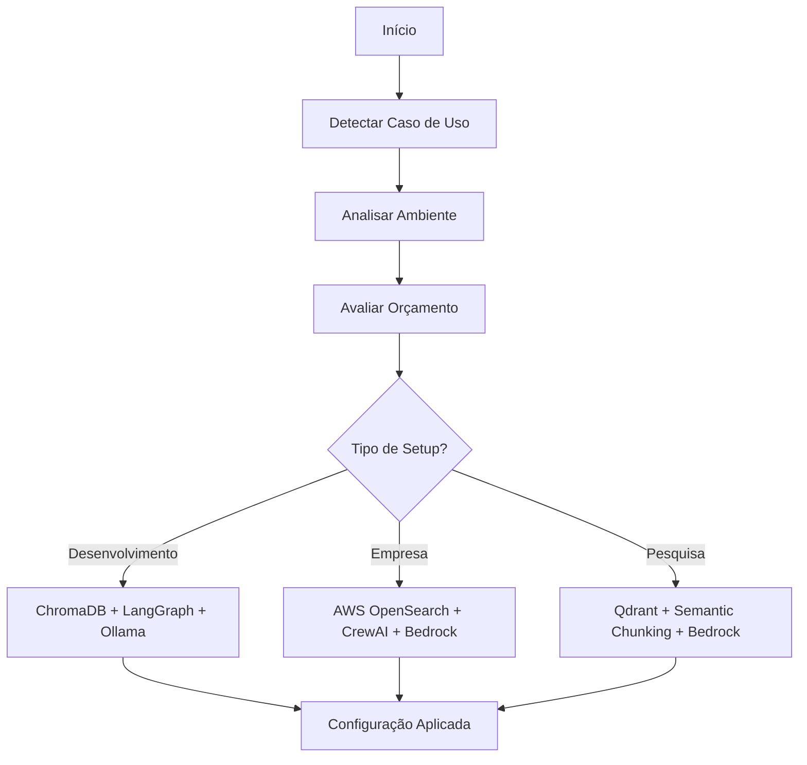

# AgentCore v2.0 🚀

Biblioteca Python enterprise-ready para construção de agentes de IA com orquestração multi-framework, armazenamento vetorial multi-provedor e capacidades avançadas de avaliação.

[](https://www.python.org/downloads/)
[](https://opensource.org/licenses/MIT)
[]()

## 🌟 Características Principais v2.0

### 🔧 **Multi-Framework Orchestration**
- **CrewAI**: Cenários empresariais complexos com multi-agentes
- **LangGraph**: Fluxos simples e sequenciais
- **AutoGen**: Conversas e execução de código
- **Auto-seleção**: Escolha automática baseada no caso de uso

### 🗄️ **Multi-Provider Vector Storage**
- **AWS OpenSearch**: Produção empresarial escalável
- **AWS Kendra**: Busca empresarial com ML
- **AWS S3 + FAISS**: Solução econômica
- **Qdrant**: Vector search nativo e rápido
- **ChromaDB**: Desenvolvimento local
- **Pinecone**: Vector search gerenciado
- **FAISS**: Research e alta performance

### ✂️ **Advanced Chunking Strategies**
- **Semantic**: Agrupamento por similaridade
- **Recursive**: Preserva boundaries hierárquicos
- **Sliding Window**: Overlap controlado
- **Markdown-Aware**: Preserva estrutura de documentação
- **Code-Aware**: Específico para código fonte
- **Auto-detection**: Detecção automática do tipo de conteúdo

### 🏭 **Production-Ready Features**
- **Multi-provedor LLM**: AWS Bedrock, OpenAI, Ollama, Google Gemini
- **Sistema de avaliação**: Framework OpenAI/evals para validação
- **Comparação de modelos**: Performance entre diferentes LLMs
- **Reasoning avançado**: Chain-of-thought e step-by-step
- **Observabilidade completa**: Tracing, métricas e visualização
- **Auto-configuração**: Baseada em caso de uso e ambiente
- **Health monitoring**: Checks automáticos e métricas de uso
- **AWS Integration**: Bedrock, OpenSearch, S3, Kendra
- **Conversão API2Tool**: OpenAPI para ferramentas LangGraph

## 📦 Instalação

### 🔧 Instalação Local (Desenvolvimento)
```bash
# Clone do repositório
git clone <url-do-repositorio>
cd agentcore

# Ambiente virtual (recomendado)
python -m venv venv
source venv/bin/activate  # Linux/Mac
# ou venv\Scripts\activate  # Windows

# Instalação em modo desenvolvimento
pip install -e .

# Ou com todas as dependências
pip install -e .[aws,crewai,semantic,qdrant,dev]
```

### 📋 Requisitos do Sistema
- Python 3.8 ou superior
- pip (gerenciador de pacotes Python)
- Acesso à internet para download das dependências

### 📦 Instalação via PyPI (Quando Disponível)
```bash
# Instalação básica
pip install agentcore

# Para produção AWS
pip install agentcore[aws]

# Para desenvolvimento avançado
pip install agentcore[crewai,semantic,qdrant]

# Instalação completa
pip install agentcore[full]
```

### 🐳 Docker
```dockerfile
FROM python:3.11-slim
WORKDIR /app
COPY requirements.txt .
RUN pip install -r requirements.txt
RUN pip install agentcore[aws]
COPY . .
CMD ["python", "app.py"]
```

## 🚀 Início Rápido

### 🎯 Conceitos Fundamentais

1. **api2tool**: Converte APIs OpenAPI em ferramentas utilizáveis
2. **Multi-Framework**: Orquestração inteligente (CrewAI, LangGraph, AutoGen)
3. **Multi-Provider**: Storage vetorial flexível (AWS, Qdrant, ChromaDB, etc.)
4. **Auto-Configuration**: Configuração baseada em caso de uso
5. **Advanced Features**: Avaliação, observabilidade, chunking inteligente

### 🔧 Uso Básico

```python
from agentCore.utils import api2tool
from agentCore.providers import get_llm
from agentCore import get_orchestrator, get_vector_store

# 1. Configuração automática baseada no ambiente
llm = get_llm()  # Auto-seleciona provedor
orchestrator = get_orchestrator("auto")  # Auto-seleciona framework
vector_store = get_vector_store()  # Auto-configura storage

# 2. Conversão de API para ferramentas
tools = api2tool("./api.json")
print(f"Geradas {len(tools)} ferramentas")
```

### 🏢 Configuração Empresarial

```python
from agentCore import auto_configure_vector_store, get_orchestrator

# Auto-configuração para ambiente empresarial
store = auto_configure_vector_store(
    use_case="enterprise",
    environment="production",
    budget="high"
)
# Auto-seleciona: AWS OpenSearch

orchestrator = get_orchestrator("auto",
    use_case="enterprise",
    complexity="high",
    team_size="large"
)
# Auto-seleciona: CrewAI
```

### 🧪 Desenvolvimento Local

```python
# Setup rápido para desenvolvimento
store = auto_configure_vector_store("development", "development", "low")
# Auto-seleciona: ChromaDB local

orchestrator = get_orchestrator("auto", complexity="low")
# Auto-seleciona: LangGraph
```

### 📊 Avaliação e Monitoramento

```python
from agentCore.evaluation import PromptEvaluator, ModelComparator
from agentCore.observability import get_tracer

# Sistema de avaliação
evaluator = PromptEvaluator()
results = evaluator.evaluate_dataset(test_cases)

# Comparação de modelos
comparator = ModelComparator(["bedrock", "openai"])
comparison = comparator.compare_on_dataset(test_cases)

# Observabilidade
tracer = get_tracer()
with tracer.trace_execution("complex_task"):
    # Sua operação aqui
    pass
```

## ⚙️ Configuração

### 📁 Arquivo .env

```bash
# ========================================
# CONFIGURAÇÃO PRINCIPAL
# ========================================
MAIN_PROVIDER=bedrock
ORCHESTRATOR_TYPE=auto
VECTOR_STORE_TYPE=auto

# ========================================
# AWS BEDROCK (PRODUÇÃO RECOMENDADA)
# ========================================
AWS_REGION=us-east-1
AWS_ACCESS_KEY_ID=your_access_key
AWS_SECRET_ACCESS_KEY=your_secret_key
BEDROCK_MODEL=anthropic.claude-3-sonnet-20240229-v1:0
BEDROCK_EMBEDDINGS_MODEL=amazon.titan-embed-text-v1

# ========================================
# VECTOR STORES
# ========================================
# AWS OpenSearch
OPENSEARCH_ENDPOINT=https://your-domain.us-east-1.es.amazonaws.com
OPENSEARCH_REGION=us-east-1

# Qdrant
QDRANT_URL=http://localhost:6333
QDRANT_API_KEY=your_qdrant_key

# Pinecone
PINECONE_API_KEY=your_pinecone_key
PINECONE_ENVIRONMENT=us-east1-gcp

# ========================================
# OUTROS PROVEDORES LLM
# ========================================
# OpenAI
OPENAI_API_KEY=your_openai_key
OPENAI_MODEL=gpt-4

# Ollama (Local)
OLLAMA_BASE_URL=http://localhost:11434
OLLAMA_MODEL=llama3:latest

# Google Gemini
GEMINI_API_KEY=your_gemini_key
GEMINI_MODEL=gemini-1.5-flash

# ========================================
# CONFIGURAÇÕES AVANÇADAS
# ========================================
LOG_LEVEL=INFO
TRACING_ENABLED=true
CACHE_ENABLED=true
CHUNKING_STRATEGY=auto
```

### 🔧 Configuração por Código

```python
import os
from agentCore import configure_environment

# Configuração programática
configure_environment(
    main_provider="bedrock",
    vector_store="aws_opensearch",
    orchestrator="crewai",
    environment="production"
)

# Ou via variáveis
os.environ.update({
    'MAIN_PROVIDER': 'bedrock',
    'AWS_REGION': 'us-east-1',
    'VECTOR_STORE_TYPE': 'aws_opensearch'
})
```

### 📊 Logging e Monitoramento

```python
from agentCore.logger import get_logger
from agentCore.observability import enable_tracing, get_metrics

# Logger personalizado
logger = get_logger("minha_app", level="DEBUG")
logger.info("Aplicação iniciada")
logger.success("Operação bem-sucedida")
logger.tool_execution("api_call", duration=1.2)

# Habilitar tracing
enable_tracing(enabled=True, output_file="trace.json")

# Métricas de uso
metrics = get_metrics()
print(f"Execuções: {metrics['total_executions']}")
```

## 📚 Exemplos Práticos

### 🎯 Exemplo 1: Setup Empresarial Completo

```python
from agentCore import (
    auto_configure_vector_store,
    get_orchestrator,
    get_llm
)
from agentCore.utils import api2tool
from agentCore.evaluation import PromptEvaluator
from agentCore.observability import get_tracer

# 1. Auto-configuração para produção
store = auto_configure_vector_store(
    use_case="enterprise",
    environment="production",
    budget="high"
)
# Resultado: AWS OpenSearch configurado automaticamente

orchestrator = get_orchestrator("auto",
    use_case="enterprise",
    complexity="high"
)
# Resultado: CrewAI selecionado automaticamente

llm = get_llm()  # Bedrock por padrão

# 2. Carregar APIs empresariais
weather_tools = api2tool("./weather_api.json")
crm_tools = api2tool("./crm_api.json")
analytics_tools = api2tool("./analytics_api.json")

# 3. Criar agente empresarial
all_tools = []
for tools in [weather_tools, crm_tools, analytics_tools]:
    all_tools.extend([tool['function'] for tool in tools])

agent = orchestrator.create_agent(llm, tools=all_tools)

# 4. Sistema de avaliação
evaluator = PromptEvaluator()
test_cases = [
    {"input": "Clima em SP?", "expected": "temperatura"},
    {"input": "Vendas Q4?", "expected": "relatório"}
]
results = evaluator.evaluate_dataset(test_cases, agent)
print(f"Acurácia: {results['accuracy']:.2%}")

# 5. Observabilidade
tracer = get_tracer()
with tracer.trace_execution("enterprise_query"):
    response = agent.invoke({
        "messages": [{"role": "user", "content": "Análise completa do Q4"}]
    })
```

### 🧪 Exemplo 2: Desenvolvimento Local com Ollama

```python
from agentCore import get_vector_store, get_orchestrator
from agentCore.providers import get_llm
from agentCore.chunking import get_chunking_strategy, ChunkingMethod

# Setup local otimizado
store = get_vector_store("chromadb", {"persist_directory": "./local_db"})
orchestrator = get_orchestrator("langgraph")  # Simples para desenvolvimento
llm = get_llm("ollama")

# Chunking inteligente
chunker = get_chunking_strategy(ChunkingMethod.SEMANTIC)
documents = [
    "Documentação técnica longa...",
    "Código Python com funções...",
    "Artigo científico..."
]

for doc in documents:
    chunks = chunker.chunk(doc, metadata={"source": "local"})
    store.add_documents(chunks)

# Query com contexto
results = store.similarity_search("Como implementar autenticação?")
context = "\n".join([r.page_content for r in results])

response = llm.invoke(f"Contexto: {context}\n\nPergunta: Como implementar autenticação?")
print(response.content)
```

### 🔬 Exemplo 3: Comparação de Modelos

```python
from agentCore.evaluation import ModelComparator
from agentCore.providers import get_llm

# Configurar múltiplos modelos
models = {
    "bedrock_sonnet": get_llm("bedrock"),
    "openai_gpt4": get_llm("openai"),
    "ollama_llama3": get_llm("ollama")
}

# Dataset de teste
test_cases = [
    {
        "input": "Explique machine learning",
        "expected_keywords": ["algoritmo", "dados", "treinamento"]
    },
    {
        "input": "Como fazer uma API REST?",
        "expected_keywords": ["HTTP", "endpoint", "JSON"]
    }
]

# Comparação automática
comparator = ModelComparator(models)
results = comparator.compare_on_dataset(test_cases)

# Resultados detalhados
for model_name, metrics in results.items():
    print(f"{model_name}:")
    print(f"  Acurácia: {metrics['accuracy']:.2%}")
    print(f"  Latência: {metrics['avg_latency']:.2f}s")
    print(f"  Score: {metrics['weighted_score']:.2f}")
```

### 🎨 Exemplo 4: Chunking Avançado

```python
from agentCore.chunking import (
    get_chunking_strategy,
    ChunkingMethod,
    detect_content_type
)

# Auto-detecção de tipo de conteúdo
def smart_chunk(text, content_type="auto"):
    if content_type == "auto":
        content_type = detect_content_type(text)

    strategy_map = {
        "markdown": ChunkingMethod.MARKDOWN_AWARE,
        "code": ChunkingMethod.CODE_AWARE,
        "academic": ChunkingMethod.SEMANTIC,
        "general": ChunkingMethod.RECURSIVE
    }

    method = strategy_map.get(content_type, ChunkingMethod.RECURSIVE)
    chunker = get_chunking_strategy(method)
    return chunker.chunk(text)

# Exemplos com diferentes tipos
markdown_doc = """
# Título Principal
## Seção 1
Conteúdo da seção...
### Subseção
Mais conteúdo...
"""

code_doc = """
def calculate_total(items):
    \"\"\"Calcula o total dos itens\"\"\"
    return sum(item.price for item in items)

class ShoppingCart:
    def __init__(self):
        self.items = []
"""

# Chunking automático
md_chunks = smart_chunk(markdown_doc)  # Detecta: markdown
code_chunks = smart_chunk(code_doc)    # Detecta: code

print(f"Markdown: {len(md_chunks)} chunks")
print(f"Code: {len(code_chunks)} chunks")
```

## 🏗️ Arquitetura v2.0

```
agentCore/
├── utils/              # 🔧 Utilidades principais
│   ├── api2tool.py        # Conversão OpenAPI → Ferramentas
│   └── openapi_to_tools.py
├── providers/          # 🤖 Provedores LLM multi-cloud
│   ├── llm_providers.py   # AWS Bedrock, OpenAI, Ollama, Gemini
│   └── vector_store_factory.py
├── orchestration/      # 🎭 Multi-framework orchestration
│   ├── crewai_orchestrator.py    # CrewAI para empresas
│   ├── langgraph_orchestrator.py # LangGraph para fluxos simples
│   ├── autogen_orchestrator.py   # AutoGen para conversas
│   └── auto_selector.py          # Auto-seleção inteligente
├── vector_stores/      # 🗄️ Storage vetorial multi-provedor
│   ├── aws_opensearch.py         # AWS OpenSearch
│   ├── aws_kendra.py             # AWS Kendra
│   ├── aws_s3_faiss.py           # AWS S3 + FAISS
│   ├── qdrant_provider.py        # Qdrant local/cloud
│   ├── chromadb_provider.py      # ChromaDB
│   ├── pinecone_provider.py      # Pinecone
│   └── faiss_provider.py         # FAISS local
├── evaluation/         # 📊 Sistema de avaliação
│   ├── prompt_evaluator.py       # OpenAI/evals style
│   ├── model_comparison.py       # Comparação de modelos
│   └── metrics.py                # Métricas de performance
├── reasoning/          # 🧠 Reasoning avançado
│   ├── chain_of_thought.py       # Chain of Thought
│   └── step_by_step.py           # Step-by-step reasoning
├── chunking/           # ✂️ Estratégias de chunking
│   ├── text_chunker.py           # Múltiplas estratégias
│   ├── semantic_chunker.py       # Chunking semântico
│   ├── code_chunker.py           # Específico para código
│   └── content_detector.py       # Auto-detecção de tipo
├── observability/      # 🔍 Observabilidade completa
│   ├── agent_tracer.py           # Tracing de execuções
│   ├── metrics_collector.py      # Coleta de métricas
│   └── visualization.py          # Visualização de traces
├── graphs/             # 🕸️ Orquestração LangGraph (legado)
│   └── graph.py
└── logger/             # 📝 Sistema de logging
    └── logger.py
```

### 🔄 Fluxo de Auto-Configuração



## 🔍 Casos de Uso e Recomendações

### 🏢 **Empresa/Produção**
```python
# Setup automático para produção
store = auto_configure_vector_store("enterprise", "production", "high")
# ✅ Resultado: AWS OpenSearch

orchestrator = get_orchestrator("auto", use_case="enterprise")
# ✅ Resultado: CrewAI com multi-agentes

llm = get_llm("bedrock")  # Claude 3 Sonnet
```

**Características:**
- ☁️ AWS OpenSearch para vectors (escalável)
- 🤖 CrewAI para orquestração complexa
- 🔒 AWS Bedrock para LLM (seguro)
- 📊 Monitoring e health checks integrados

### 🧪 **Desenvolvimento Local**
```python
# Setup rápido para desenvolvimento
store = auto_configure_vector_store("development", "development", "low")
# ✅ Resultado: ChromaDB local

orchestrator = get_orchestrator("auto", complexity="low")
# ✅ Resultado: LangGraph

llm = get_llm("ollama")  # Llama3 local
```

**Características:**
- 💻 ChromaDB local (sem custos)
- 🔗 LangGraph simples
- 🏠 Ollama para LLM local
- ⚡ Setup em segundos

### 🔬 **Pesquisa/Academia**
```python
# Setup para pesquisa
store = auto_configure_vector_store("research", "development", "medium")
# ✅ Resultado: Qdrant com embeddings semânticos

chunker = get_chunking_strategy(ChunkingMethod.SEMANTIC)
# ✅ Chunking baseado em similaridade semântica
```

**Características:**
- 🧠 Qdrant para vector search avançado
- 📚 Chunking semântico para papers
- 📊 Métricas detalhadas de performance
- 🔬 Ferramentas de análise

## 📊 Comparação de Versões

| **Aspecto** | **v1.0** | **v2.0** |
|-------------|----------|----------|
| **Orchestration** | ❌ Apenas LangGraph | ✅ Multi-framework (CrewAI, LangGraph, AutoGen) |
| **Vector Storage** | ❌ Apenas ChromaDB | ✅ 7+ providers (AWS, Qdrant, Pinecone, etc.) |
| **Chunking** | ❌ Split básico | ✅ 7+ estratégias inteligentes |
| **Production** | ❌ Apenas desenvolvimento | ✅ AWS-native, enterprise-ready |
| **Configuration** | ❌ Manual | ✅ Auto-configuração baseada em use case |
| **Scalability** | ❌ Limitada | ✅ Enterprise-grade |
| **Evaluation** | ❌ Não disponível | ✅ OpenAI/evals + comparação de modelos |
| **Observability** | ❌ Logs básicos | ✅ Tracing completo + métricas |

## 🚀 Migration Guide (v1.0 → v2.0)

### ✅ **Mudanças Não-Disruptivas**
```python
# ✅ Código v1.0 continua funcionando
from agentCore.utils import api2tool
from agentCore.providers import get_llm
from agentCore.graphs import create_agent_graph

# Funciona exatamente igual
tools = api2tool("api.json")
llm = get_llm()
agent = create_agent_graph(llm, tools)
```

### 🆕 **Novas Funcionalidades Opcionais**
```python
# 🆕 Adicione gradualmente as melhorias
from agentCore import get_vector_store, get_orchestrator

# Upgrade incremental
vector_store = get_vector_store()  # Auto-configure
orchestrator = get_orchestrator("auto")  # Auto-select
```

## 📋 Changelog

### [2.0.0] - 2024-12-29

#### ✨ Adicionado
- **Multi-Framework Orchestration**: CrewAI, LangGraph, AutoGen
- **Multi-Provider Vector Storage**: AWS OpenSearch, Kendra, S3+FAISS, Qdrant, Pinecone
- **Advanced Chunking**: 7+ estratégias inteligentes
- **Auto-Configuration**: Baseada em caso de uso
- **Evaluation Framework**: OpenAI/evals style
- **Model Comparison**: Performance entre LLMs
- **Advanced Observability**: Tracing e métricas
- **Production Features**: AWS integration, health monitoring

#### 🔄 Melhorado
- Sistema de providers LLM mais robusto
- Logging com mais níveis e contexto
- Documentação centralizada
- Performance geral

#### 🔒 Mantido (Backward Compatible)
- Interface `api2tool` original
- Configuração via variáveis de ambiente
- Estrutura básica de providers

### [1.0.0] - 2024-12-29

#### ✨ Primeira Release
- Funcionalidade principal `api2tool`
- Suporte multi-provedor LLM básico
- Sistema de logging
- Orquestração LangGraph
- Integração ChromaDB

## ✅ Verificação da Instalação

### 🧪 Teste Básico
```python
# Testar importação
from agentCore.utils import api2tool
from agentCore.providers import get_llm, get_provider_info

# Verificar provedor
info = get_provider_info()
print(f"Provedor ativo: {info['provider']}")

# Testar conversão
tools = api2tool('https://petstore.swagger.io/v2/swagger.json', output_format='info')
print(f"API: {tools['title']} - {tools['tool_count']} ferramentas")
```

### 📊 Teste Completo
```python
# Execute o demo completo
python e2e_demo_local.py
```

### 🔧 Debug
```python
from agentCore.providers import get_provider_info

# Verificar configuração
info = get_provider_info()
print(f"Configuração: {info}")

# Testar conexão
try:
    llm = get_llm()
    response = llm.invoke("test")
    print("✅ LLM funcionando")
except Exception as e:
    print(f"❌ Erro: {e}")
```

## 🔧 Desenvolvimento

### 🛠️ Setup do Ambiente
```bash
# Clone e setup
git clone <repositorio>
cd agentcore
python -m venv venv
source venv/bin/activate
pip install -e .[dev]
```

### 🧪 Testes
```bash
# Executar testes
pytest tests/ -v

# Com cobertura
pytest --cov=agentCore --cov-report=html

# Testes específicos
pytest tests/test_evaluation.py -v
```

### 📝 Formatação
```bash
# Formatação automática
black agentCore/
isort agentCore/
flake8 agentCore/

# Pre-commit hooks
pre-commit install
pre-commit run --all-files
```

### 🏗️ Build
```bash
# Build da distribuição
python -m build

# Verificar build
twine check dist/*
```

## 📄 Licença

MIT License - veja o arquivo [LICENSE](LICENSE) para detalhes.

## 🤝 Contribuindo

1. Fork o projeto
2. Crie uma branch para sua feature (`git checkout -b feature/AmazingFeature`)
3. Commit suas mudanças (`git commit -m 'Add: AmazingFeature'`)
4. Push para a branch (`git push origin feature/AmazingFeature`)
5. Abra um Pull Request

### 📋 Guidelines
- Siga o padrão de código existente
- Adicione testes para novas funcionalidades
- Atualize a documentação quando necessário
- Use conventional commits

## 📞 Suporte

- **🐛 Issues**: [GitHub Issues](https://github.com/your-org/agent-core/issues)
- **💬 Discussões**: [GitHub Discussions](https://github.com/your-org/agent-core/discussions)
- **📖 Documentação**: Veja exemplos acima
- **📧 Contato**: [email@exemplo.com](mailto:email@exemplo.com)

---

## 🎉 Conclusão

A **AgentCore v2.0** é uma biblioteca enterprise-ready que resolve todos os desafios de produção:

- ✅ **Flexibilidade**: Multi-framework, multi-provider, multi-estratégia
- ✅ **Escalabilidade**: AWS-native para produção enterprise
- ✅ **Simplicidade**: Auto-configuração baseada em caso de uso
- ✅ **Observabilidade**: Tracing, métricas e avaliação completa
- ✅ **Compatibilidade**: Mantém interface v1.0 funcionando

**Recomendação**: Use para projetos reais de produção com confiança! 🚀